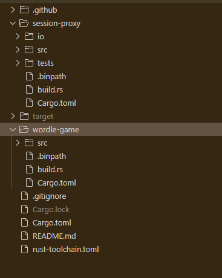
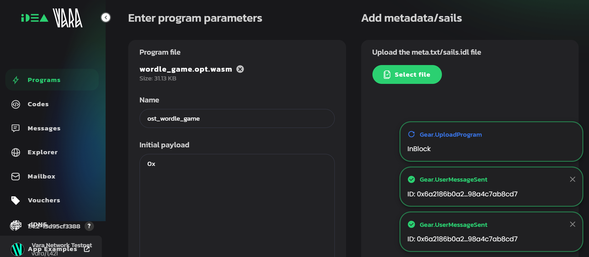

# 任务描述
在这个任务中，你的任务是编写Wordle游戏。

Wordle是一款引人入胜的猜词游戏，因其简单和令人上瘾的游戏玩法而广受欢迎。目标是在有限的尝试次数内猜出一个隐藏的单词。

游戏板由六行组成，每行允许玩家输入一个单词。输入单词后，玩家会收到反馈，指示隐藏单词中字母的存在及其正确位置。如果字母存在但位置错误，可能会以不同颜色高亮显示或用特殊符号标记。玩家利用这些线索来推断正确的字母及其位置。

游戏挑战玩家在最少的尝试次数内猜出单词，在时间和尝试次数的限制下，增加了兴奋感和悬念。

# 项目结构
将你的Wordle游戏分解为两个程序，以获得更引人入胜和灵活的体验。Wordle程序将处理核心功能，例如从列表中选择一个随机单词并评估猜测。游戏会话程序将管理用户交互、跟踪游戏状态并执行时间限制。这种划分旨在创建一个模块化、灵活的系统，增强游戏体验。

1. Wordle程序的描述：

包含“开始游戏”和“检查单词”函数。
程序中存在一个单词库，用于在游戏开始时选择一个随机单词。
“开始游戏”函数启动游戏并选择一个随机单词。
“检查单词”函数评估玩家的猜测与隐藏单词的匹配程度，提供正确字母位置的反馈。

2. 游戏会话程序的描述：

管理与Wordle程序的交互并监督游戏玩法。
跟踪之前的响应和尝试次数。
监控自游戏开始以来的经过时间，以管理时间限制和事件。

3. 程序之间的交互：

用户通过向游戏会话程序发送消息来启动游戏。
游戏会话程序调用Wordle程序的“开始游戏”函数。
用户将其猜测提交给游戏会话程序，后者将其转发给Wordle程序的“检查单词”函数。
Wordle程序返回关于猜测准确性和字母位置的反馈。
游戏会话程序分析结果，跟踪尝试次数和时间。

4. 关键实现方面：

游戏会话程序需要机制来存储有关先前移动的数据并跟踪时间。
通过数据交换和响应处理与Wordle程序的高效交互至关重要。

# 部署
https://idea.gear-tech.io/
wss://testnet.vara.network

